# Mermaid图表渲染指南

## 方法一：在线工具（最简单）

### 1. Mermaid Live Editor（官方）
- **网址**：https://mermaid.live/
- **使用方法**：
  1. 打开 https://mermaid.live/
  2. 复制 `数据库表关系图.md` 中的 Mermaid ER 图代码（从 ```mermaid 到 ``` 之间的内容）
  3. 粘贴到左侧编辑区
  4. 右侧会自动渲染预览
  5. 可以导出为 PNG、SVG 或 PDF

### 2. Mermaid.ink（在线渲染）
- **网址**：https://mermaid.ink/
- **用途**：生成图表链接，可直接嵌入到网页或文档中

### 3. GitHub / GitLab
- 如果你将文档提交到 GitHub 或 GitLab，它们会自动渲染 Mermaid 图表
- 直接在 `.md` 文件中查看即可

## 方法二：VS Code 插件

### 1. Markdown Preview Mermaid Support
- **插件名**：`Markdown Preview Mermaid Support`
- **安装**：
  1. 打开 VS Code
  2. 按 `Cmd+Shift+X` (Mac) 或 `Ctrl+Shift+X` (Windows)
  3. 搜索 "Markdown Preview Mermaid Support"
  4. 点击安装
- **使用**：
  1. 打开包含 Mermaid 代码的 `.md` 文件
  2. 按 `Cmd+Shift+V` (Mac) 或 `Ctrl+Shift+V` (Windows) 预览
  3. 图表会自动渲染

### 2. Markdown Preview Enhanced
- **插件名**：`Markdown Preview Enhanced`
- **功能更强大**，支持更多图表类型

## 方法三：Cursor IDE

Cursor 内置支持 Mermaid：
1. 打开 `数据库表关系图.md` 文件
2. 点击右上角的预览按钮（或按 `Cmd+Shift+V`）
3. Mermaid 图表会自动渲染

## 方法四：其他 Markdown 编辑器

### Typora
- **下载**：https://typora.io/
- **特点**：实时预览，完美支持 Mermaid
- **使用方法**：直接打开 `.md` 文件即可看到渲染效果

### Obsidian
- **下载**：https://obsidian.md/
- **支持 Mermaid**：需要安装插件或使用内置支持

### Notion
- Notion 支持 Mermaid，但需要创建代码块并选择语言为 "mermaid"

## 方法五：命令行工具

### 1. Mermaid CLI
```bash
# 安装
npm install -g @mermaid-js/mermaid-cli

# 渲染为图片
mmdc -i 数据库表关系图.md -o database-diagram.png
```

### 2. 使用 Docker
```bash
docker run --rm -v $(pwd):/data minlag/mermaid-cli \
  -i /data/数据库表关系图.md \
  -o /data/database-diagram.png
```

## 快速测试方法

如果你想快速查看图表效果，最简单的方法是：

1. **打开 Mermaid Live Editor**：https://mermaid.live/
2. **复制下面这段代码**（从 `数据库表关系图.md` 中提取的）：

```mermaid
erDiagram
    %% 用户域
    user_core {
        string userId PK "全局用户ID"
        string wechatOpenId UK "微信OpenId"
        string nickname "昵称"
        string phoneEncrypted "加密手机号"
        string phoneMasked "脱敏手机号"
    }
    
    user_goals {
        string userId FK "用户ID"
        int version PK "版本号"
        number targetWeightKg "目标体重"
        int dailyCaloriesKcal "日目标卡路里"
    }
    
    user_preferences {
        string userId PK "用户ID"
        string personality "AI语气"
        json reminders "提醒设置"
    }
    
    %% 服务域
    product_plans {
        string productPlanId PK "产品方案ID"
        string productPlanName "方案名称"
        string productPlanTier "方案层级"
        number basePrice "基础价格"
    }
    
    user_subscriptions {
        string subscriptionId PK "订阅ID"
        string userId FK "用户ID"
        string productPlanId FK "产品方案ID"
        string serviceStatus "服务状态"
        bool isCurrent "是否当前订阅"
    }
    
    user_service_assignment {
        string userId PK "用户ID"
        string nutritionistId FK "营养师ID"
        string assignmentStatus "分配状态"
    }
    
    user_service_assignment_history {
        string userId FK "用户ID"
        string fromNutritionistId FK "原营养师ID"
        string toNutritionistId FK "新营养师ID"
        timestamp changedAtUtc PK "变更时间"
    }
    
    nutritionists {
        string nutritionistId PK "营养师ID"
        string displayName "显示名称"
        string wechatOpenId "微信OpenId"
    }
    
    %% 业务事实
    meals {
        string mealId PK "餐食记录ID"
        string userId FK "用户ID"
        timestamp mealTimeUtc "进餐时间"
        int caloriesKcal "总热量"
        json nutritionDetails "完整营养素"
        number antiScore "抗炎总分"
    }
    
    weight {
        string weightId PK "体重记录ID"
        string userId FK "用户ID"
        timestamp measuredAtUtc "测量时间"
        number weightKg "体重"
    }
    
    exercise {
        string exerciseId PK "运动记录ID"
        string userId FK "用户ID"
        timestamp activityAtUtc "运动时间"
        int caloriesKcal "消耗热量"
    }
    
    water {
        string waterId PK "喝水记录ID"
        string userId FK "用户ID"
        timestamp drinkAtUtc "饮水时间"
        int amountMl "饮水量"
    }
    
    reports {
        string reportId PK "报告ID"
        string userId FK "用户ID"
        string reportType "报告类型"
        json metricsSnapshot "指标快照"
    }
    
    medical_reports {
        string reportId PK "报告ID"
        string userId FK "用户ID"
        timestamp reportAtUtc "报告日期"
        string fileUrl "报告文件URL"
    }
    
    conversation {
        string conversationId PK "对话ID"
        string userId FK "用户ID"
        timestamp occurredAtUtc "发生时间"
        string intent "意图"
    }
    
    %% 财务
    payments {
        string paymentId PK "支付ID"
        string userId FK "用户ID"
        string subscriptionId FK "订阅ID"
        number amount "金额"
        string status "支付状态"
    }
    
    refunds {
        string refundId PK "退款ID"
        string paymentId FK "支付ID"
        number amount "退款金额"
        string status "退款状态"
    }
    
    %% 关系定义
    user_core ||--o{ user_goals : "用户可以有多个目标版本"
    user_core ||--|| user_preferences : "一对一"
    user_core ||--o{ user_subscriptions : "用户可以有多个订阅记录"
    user_core ||--|| user_service_assignment : "一对一（当前分配）"
    user_core ||--o{ user_service_assignment_history : "用户可以有多个分配历史"
    user_core ||--o{ meals : "用户可以有多个餐食记录"
    user_core ||--o{ weight : "用户可以有多个体重记录"
    user_core ||--o{ exercise : "用户可以有多个运动记录"
    user_core ||--o{ water : "用户可以有多个喝水记录"
    user_core ||--o{ reports : "用户可以有多个报告"
    user_core ||--o{ medical_reports : "用户可以有多个体检报告"
    user_core ||--o{ conversation : "用户可以有多个对话"
    
    product_plans ||--o{ user_subscriptions : "产品方案可以有多个订阅"
    
    nutritionists ||--o{ user_service_assignment : "营养师可以分配多个用户"
    nutritionists ||--o{ user_service_assignment_history : "作为原营养师"
    nutritionists ||--o{ user_service_assignment_history : "作为新营养师"
    
    user_subscriptions ||--o{ payments : "订阅可以有多个支付记录"
    
    payments ||--o{ refunds : "支付可以有多个退款记录"
```



3. **粘贴到 Mermaid Live Editor**
4. **查看渲染效果**

## 推荐方案

根据你的使用场景：

- **快速查看**：使用 Mermaid Live Editor (https://mermaid.live/)
- **编辑文档**：在 Cursor 中预览（已内置支持）
- **专业编辑**：使用 Typora
- **导出图片**：使用 Mermaid Live Editor 的导出功能，或 Mermaid CLI

## 小贴士

1. **如果图表太大**：可以在 Mermaid Live Editor 中调整视图大小
2. **导出格式**：
   - PNG：适合文档插入
   - SVG：矢量图，可无损缩放
   - PDF：适合打印
3. **如果渲染有问题**：检查代码语法，确保关系定义格式正确


