# 数据库表关系图

## 一、总体关系图（Mermaid ER图）

```mermaid
erDiagram
    %% 用户域
    user_core {
        string userId PK "全局用户ID"
        string wechatOpenId UK "微信OpenId"
        string nickname "昵称"
        string phoneEncrypted "加密手机号"
        string phoneMasked "脱敏手机号"
    }
    
    user_goals {
        string userId FK "用户ID"
        int version PK "版本号"
        number targetWeightKg "目标体重"
        int dailyCaloriesKcal "日目标卡路里"
    }
    
    user_preferences {
        string userId PK "用户ID"
        string personality "AI语气"
        json reminders "提醒设置"
    }
    
    %% 服务域
    product_plans {
        string productPlanId PK "产品方案ID"
        string productPlanName "方案名称"
        string productPlanTier "方案层级"
        number basePrice "基础价格"
    }
    
    user_subscriptions {
        string subscriptionId PK "订阅ID"
        string userId FK "用户ID"
        string productPlanId FK "产品方案ID"
        string serviceStatus "服务状态"
        bool isCurrent "是否当前订阅"
    }
    
    user_service_assignment {
        string userId PK "用户ID"
        string nutritionistId FK "营养师ID"
        string assignmentStatus "分配状态"
    }
    
    user_service_assignment_history {
        string userId FK "用户ID"
        string fromNutritionistId FK "原营养师ID"
        string toNutritionistId FK "新营养师ID"
        timestamp changedAtUtc PK "变更时间"
    }
    
    nutritionists {
        string nutritionistId PK "营养师ID"
        string displayName "显示名称"
        string wechatOpenId "微信OpenId"
    }
    
    %% 业务事实
    meals {
        string mealId PK "餐食记录ID"
        string userId FK "用户ID"
        timestamp mealTimeUtc "进餐时间"
        int caloriesKcal "总热量"
        json nutritionDetails "完整营养素"
        number antiScore "抗炎总分"
    }
    
    weight {
        string weightId PK "体重记录ID"
        string userId FK "用户ID"
        timestamp measuredAtUtc "测量时间"
        number weightKg "体重"
    }
    
    exercise {
        string exerciseId PK "运动记录ID"
        string userId FK "用户ID"
        timestamp activityAtUtc "运动时间"
        int caloriesKcal "消耗热量"
    }
    
    water {
        string waterId PK "喝水记录ID"
        string userId FK "用户ID"
        timestamp drinkAtUtc "饮水时间"
        int amountMl "饮水量"
    }
    
    reports {
        string reportId PK "报告ID"
        string userId FK "用户ID"
        string reportType "报告类型"
        json metricsSnapshot "指标快照"
    }
    
    medical_reports {
        string reportId PK "报告ID"
        string userId FK "用户ID"
        timestamp reportAtUtc "报告日期"
        string fileUrl "报告文件URL"
    }
    
    conversation {
        string conversationId PK "对话ID"
        string userId FK "用户ID"
        timestamp occurredAtUtc "发生时间"
        string intent "意图"
    }
    
    %% 财务
    payments {
        string paymentId PK "支付ID"
        string userId FK "用户ID"
        string subscriptionId FK "订阅ID"
        number amount "金额"
        string status "支付状态"
    }
    
    refunds {
        string refundId PK "退款ID"
        string paymentId FK "支付ID"
        number amount "退款金额"
        string status "退款状态"
    }
    
    %% 关系定义
    user_core ||--o{ user_goals : "用户可以有多个目标版本"
    user_core ||--|| user_preferences : "一对一"
    user_core ||--o{ user_subscriptions : "用户可以有多个订阅记录"
    user_core ||--|| user_service_assignment : "一对一（当前分配）"
    user_core ||--o{ user_service_assignment_history : "用户可以有多个分配历史"
    user_core ||--o{ meals : "用户可以有多个餐食记录"
    user_core ||--o{ weight : "用户可以有多个体重记录"
    user_core ||--o{ exercise : "用户可以有多个运动记录"
    user_core ||--o{ water : "用户可以有多个喝水记录"
    user_core ||--o{ reports : "用户可以有多个报告"
    user_core ||--o{ medical_reports : "用户可以有多个体检报告"
    user_core ||--o{ conversation : "用户可以有多个对话"
    
    product_plans ||--o{ user_subscriptions : "产品方案可以有多个订阅"
    
    nutritionists ||--o{ user_service_assignment : "营养师可以分配多个用户"
    nutritionists ||--o{ user_service_assignment_history : "作为原营养师"
    nutritionists ||--o{ user_service_assignment_history : "作为新营养师"
    
    user_subscriptions ||--o{ payments : "订阅可以有多个支付记录"
    
    payments ||--o{ refunds : "支付可以有多个退款记录"
```



## 二、表关系详细说明

### 2.1 用户域（User Domain）

```
user_core (用户主档)
    ├── 1:1 → user_preferences (用户偏好)
    ├── 1:N → user_goals (用户目标，支持版本化)
    └── 1:N → 所有业务事实表（meals, weight, exercise等）
```

**关系说明**：
- `user_core` 是核心用户表，所有其他表都通过 `userId` 关联
- `user_preferences` 与 `user_core` 一对一关系
- `user_goals` 与 `user_core` 一对多关系（一个用户可以有多个版本的目标）
- `user_core` 现已合并 `user_contacts`（手机号字段）

### 2.2 服务域（Service Domain）

```
product_plans (产品方案模板)
    └── 1:N → user_subscriptions (订阅记录)

user_subscriptions (订阅/服务)
    ├── N:1 → user_core (用户)
    ├── N:1 → product_plans (产品方案)
    ├── 1:N → payments (支付记录)
    └── 1:1 → user_service_assignment (营养师分配)

user_service_assignment (当前营养师分配)
    ├── 1:1 → user_core (用户)
    └── N:1 → nutritionists (营养师)

user_service_assignment_history (分配历史)
    ├── N:1 → user_core (用户)
    ├── N:1 → nutritionists (原营养师)
    └── N:1 → nutritionists (新营养师)

nutritionists (营养师)
    └── 1:N → user_service_assignment (分配的用户)
```

**关系说明**：
- `product_plans` 是模板表，不直接关联用户，供订阅引用
- `user_subscriptions` 合并了 `subscriptions` 和 `user_service`，通过 `isCurrent` 区分当前和历史
- 一个用户可以有多个订阅记录（历史），但只有一个 `isCurrent=true`
- `user_service_assignment` 记录当前分配，`user_service_assignment_history` 记录历史变更

### 2.3 业务事实域（Business Facts Domain）

```
user_core (用户)
    ├── 1:N → meals (餐食记录)
    ├── 1:N → weight (体重记录)
    ├── 1:N → exercise (运动记录)
    ├── 1:N → water (喝水记录)
    ├── 1:N → reports (日报/周报)
    ├── 1:N → medical_reports (体检报告)
    └── 1:N → conversation (对话记录)
```

**关系说明**：
- 所有业务事实表都与 `user_core` 一对多关系
- `meals` 表已合并 `meals_anti_score`（抗炎评分字段）
- `meals` 表新增 `nutritionDetails` 字段（完整营养素分布）

### 2.4 财务域（Finance Domain）

```
user_subscriptions (订阅)
    └── 1:N → payments (支付记录)

payments (支付)
    └── 1:N → refunds (退款记录)
```

**关系说明**：
- `payments` 关联 `user_subscriptions`，记录订阅的支付
- `refunds` 关联 `payments`，记录退款

## 三、表关系矩阵

| 主表 | 关联表 | 关系类型 | 外键字段 | 说明 |
|------|--------|----------|----------|------|
| user_core | user_goals | 1:N | userId | 一个用户可以有多个目标版本 |
| user_core | user_preferences | 1:1 | userId | 一对一 |
| user_core | user_subscriptions | 1:N | userId | 一个用户可以有多个订阅记录 |
| user_core | user_service_assignment | 1:1 | userId | 当前分配（一对一） |
| user_core | user_service_assignment_history | 1:N | userId | 分配历史（一对多） |
| user_core | meals | 1:N | userId | 餐食记录 |
| user_core | weight | 1:N | userId | 体重记录 |
| user_core | exercise | 1:N | userId | 运动记录 |
| user_core | water | 1:N | userId | 喝水记录 |
| user_core | reports | 1:N | userId | 报告 |
| user_core | medical_reports | 1:N | userId | 体检报告 |
| user_core | conversation | 1:N | userId | 对话记录 |
| product_plans | user_subscriptions | 1:N | productPlanId | 产品方案可被多个订阅引用 |
| user_subscriptions | payments | 1:N | subscriptionId | 订阅可以有多个支付记录 |
| payments | refunds | 1:N | paymentId | 支付可以有多个退款记录 |
| nutritionists | user_service_assignment | 1:N | nutritionistId | 营养师可以分配多个用户 |
| nutritionists | user_service_assignment_history | 1:N | fromNutritionistId/toNutritionistId | 作为原/新营养师 |

## 四、关键约束说明

### 4.1 唯一性约束

| 表名 | 唯一约束 | 说明 |
|------|----------|------|
| user_core | userId (PK) | 主键 |
| user_core | wechatOpenId (UK) | 微信OpenId唯一（同端） |
| user_goals | (userId, version) (PK) | 联合主键 |
| user_subscriptions | subscriptionId (PK) | 主键 |
| user_subscriptions | (userId, isCurrent) (UK, where isCurrent=true) | 一个用户只能有一条当前订阅 |
| user_service_assignment | userId (PK) | 一对一，一个用户一条当前分配 |

### 4.2 外键关系

| 外键表 | 外键字段 | 引用表 | 引用字段 | 关系 |
|--------|----------|--------|----------|------|
| user_goals | userId | user_core | userId | N:1 |
| user_preferences | userId | user_core | userId | 1:1 |
| user_subscriptions | userId | user_core | userId | N:1 |
| user_subscriptions | productPlanId | product_plans | productPlanId | N:1 |
| user_service_assignment | userId | user_core | userId | 1:1 |
| user_service_assignment | nutritionistId | nutritionists | nutritionistId | N:1 |
| user_service_assignment_history | userId | user_core | userId | N:1 |
| user_service_assignment_history | fromNutritionistId | nutritionists | nutritionistId | N:1 |
| user_service_assignment_history | toNutritionistId | nutritionists | nutritionistId | N:1 |
| meals | userId | user_core | userId | N:1 |
| weight | userId | user_core | userId | N:1 |
| exercise | userId | user_core | userId | N:1 |
| water | userId | user_core | userId | N:1 |
| reports | userId | user_core | userId | N:1 |
| medical_reports | userId | user_core | userId | N:1 |
| conversation | userId | user_core | userId | N:1 |
| payments | userId | user_core | userId | N:1 |
| payments | subscriptionId | user_subscriptions | subscriptionId | N:1 |
| refunds | paymentId | payments | paymentId | N:1 |

## 五、数据流向图

```
┌─────────────┐
│ product_plans│ (模板表)
└──────┬──────┘
       │ 引用
       ▼
┌──────────────────┐
│user_subscriptions│ ←──┐
└──────┬───────────┘    │
       │ 购买            │ 续费/退款
       ▼                 │
┌─────────────┐          │
│  payments   │          │
└──────┬──────┘          │
       │ 退款            │
       ▼                 │
┌─────────────┘          │
│  refunds               │
└────────────────────────┘

┌─────────────┐
│  user_core  │ (核心用户表)
└──────┬──────┘
       │
       ├──→ user_preferences (偏好)
       ├──→ user_goals (目标，版本化)
       ├──→ user_subscriptions (订阅)
       │        └──→ user_service_assignment (营养师分配)
       │
       ├──→ meals (餐食记录)
       ├──→ weight (体重记录)
       ├──→ exercise (运动记录)
       ├──→ water (喝水记录)
       ├──→ reports (报告，汇总以上数据)
       ├──→ medical_reports (体检报告)
       └──→ conversation (对话记录)
```

## 六、查询路径示例

### 6.1 查询用户完整信息
```
user_core (userId)
  ├── JOIN user_preferences (userId)
  ├── JOIN user_goals (userId, status='active')
  └── JOIN user_subscriptions (userId, isCurrent=true)
```

### 6.2 查询用户订阅历史
```
user_core (userId)
  └── JOIN user_subscriptions (userId)
       └── JOIN product_plans (productPlanId)
       └── JOIN payments (subscriptionId)
            └── JOIN refunds (paymentId)
```

### 6.3 查询用户营养数据
```
user_core (userId)
  ├── JOIN meals (userId) WHERE mealTimeUtc BETWEEN ...
  ├── JOIN weight (userId) WHERE measuredAtUtc BETWEEN ...
  ├── JOIN exercise (userId) WHERE activityAtUtc BETWEEN ...
  └── JOIN water (userId) WHERE drinkAtUtc BETWEEN ...
       └── 汇总生成 reports
```

### 6.4 查询营养师分配的用户
```
nutritionists (nutritionistId)
  └── JOIN user_service_assignment (nutritionistId)
       └── JOIN user_core (userId)
            └── JOIN user_subscriptions (userId, isCurrent=true)
```

## 七、注意事项

1. **合并后的表**：
   - `user_core` 已合并 `user_contacts`（手机号字段）
   - `user_subscriptions` 已合并 `subscriptions` 和 `user_service`
   - `meals` 已合并 `meals_anti_score`

2. **版本化设计**：
   - `user_goals` 支持版本化（通过 version 字段）
   - `user_subscriptions` 通过 `isCurrent` 区分当前和历史

3. **软删除**：
   - 建议所有表使用软删除（`deletedAt` 字段）
   - 不级联删除业务事实数据

4. **时间字段**：
   - 所有时间字段统一使用 UTC
   - 展示时按 `timeZone` 转换

5. **索引优化**：
   - 所有外键字段建立索引
   - 时间字段建立索引（用于范围查询）
   - `user_subscriptions.isCurrent` 需要与 `userId` 建立联合唯一索引


